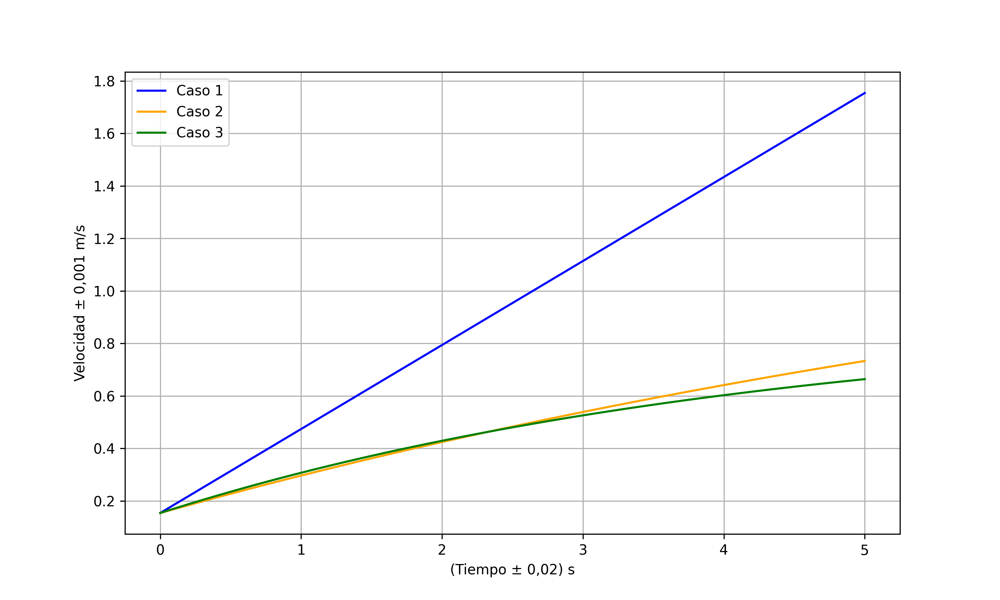
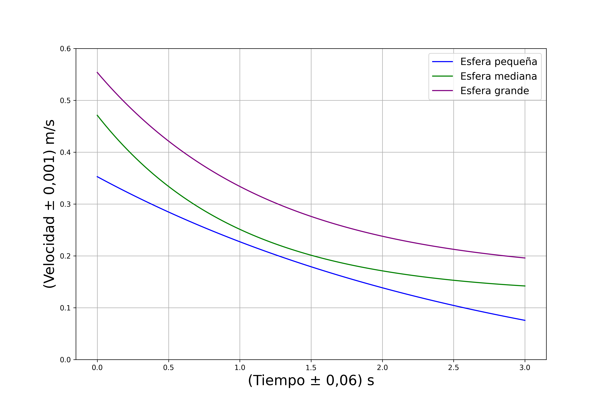
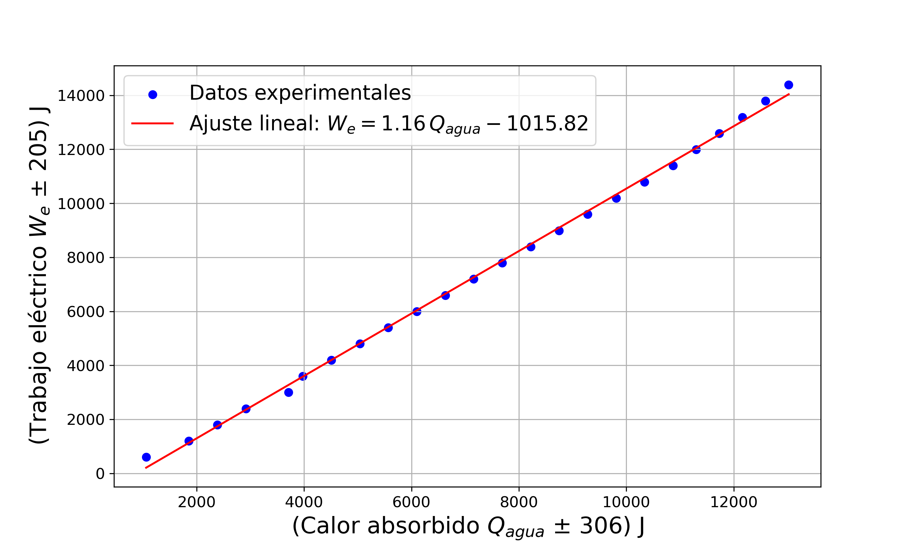
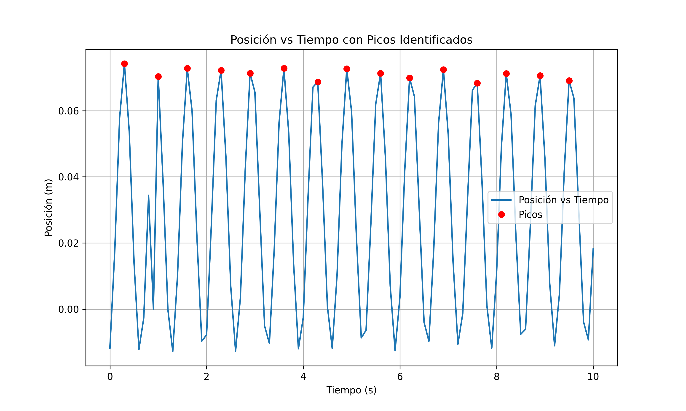

# FIS200 — Física Experimental

Códigos de análisis desarrollados para el curso **FIS200 (Física Experimental)**, organizados
por experiencias. Cada experiencia incluye los scripts relevantes, su fundamento físico y una
descripción del objetivo de cada uno.

> ⚠️ **Sobre los datos:** las experiencias 2, 4 (ajuste exponencial), 5 y 6 tienen sus
> mediciones incluidas dentro del propio código: se ejecutan tal cual y reproducen las figuras
> que aparecen más abajo. Las experiencias 1, 3, 4 (viscosidad) y 7 leen archivos `.txt`
> tomados directamente del instrumental del laboratorio, que **no están incluidos** en el
> repositorio; esos scripts se publican como referencia del método de análisis y del
> tratamiento de errores, no como un cálculo reproducible de extremo a extremo.

**Dependencias:** `numpy`, `pandas`, `matplotlib`, `scipy` (ver `requirements.txt` en la raíz
del repositorio).

---

## 🔹 Experiencias

### 1. Experiencia 1 — Determinación de la constante elástica, análisis de distancias y comparación teórico–experimental

En esta experiencia se trabajó con un sistema de lanzamiento usando un resorte comprimido.
Los objetivos principales fueron:

- Calcular la constante elástica $K$ a partir de mediciones experimentales.
- Analizar trayectorias de proyectiles a distintos ángulos.
- Ajustar curvas promedio y compararlas con tendencias teóricas.
- Calcular promedios, desviaciones estándar y realizar propagación de errores.
- Comparar distancias medidas con predicciones físicas.

**Scripts Relevantes:**

- [`parametros_resorte.py`](./Experiencias/Experiencia_1/parametros_resorte.py): Módulo base. Centraliza las mediciones, sus incertidumbres y el cálculo de $K$; los demás scripts de la experiencia lo importan en lugar de repetir valores.
- [`calculo_k_y_error.py`](./Experiencias/Experiencia_1/calculo_k_y_error.py): Cálculo de $K$, su desviación estándar y propagación de errores.
- [`trayectorias_0deg_promedio.py`](./Experiencias/Experiencia_1/trayectorias_0deg_promedio.py): Lectura de datos a 0°, normalización de coordenadas, graficación de trayectorias y tendencia promedio.
- [`trayectorias_30deg_ajuste.py`](./Experiencias/Experiencia_1/trayectorias_30deg_ajuste.py): Procesamiento de datos a 30°, ajuste cuadrático promedio y comparación con la curva teórica.
- [`estadistica_distancias.py`](./Experiencias/Experiencia_1/estadistica_distancias.py): Cálculo de promedios y desviaciones estándar para distancias medidas.
- [`distancias_teoricas_vs_experimentales.py`](./Experiencias/Experiencia_1/distancias_teoricas_vs_experimentales.py): Cálculo de distancias teóricas (15°, 30°, 45°) con propagación de errores y comparación experimental.

---

### 2. Experiencia 2 — Dinámica del movimiento con y sin roce

En esta experiencia se analizó la evolución temporal de la velocidad de un bloque deslizándose por un riel inclinado bajo tres condiciones distintas: sin roce, con roce débil y con roce más intenso.

Se implementó un único script que calcula las expresiones de velocidad para cada modelo y genera un gráfico comparativo.

**Script Relevante:**

- [`analisis_velocidad_con_y_sin_roce.py`](./Experiencias/Experiencia_2/analisis_velocidad_con_y_sin_roce.py): Contiene el cálculo de:
  - Velocidad sin roce usando:

$$
v(t) = v_0 + a t
$$
  - Velocidad con roce lineal usando:

$$
v(t) = v_f + (v_0 - v_f)e^{-\gamma t}
$$

  Además, genera un gráfico comparativo entre los tres casos.

---

### 3. Experiencia 3 — Análisis del coeficiente de difusión

En esta experiencia se estudió el movimiento aleatorio de una partícula utilizando datos experimentales de posición $x(t)$ y $y(t)$.
A partir de estos datos se calculó el desplazamiento radial $r(t)$ y se obtuvo el coeficiente de difusión mediante un ajuste lineal de $r^2(t)$ frente al tiempo.

La relación fundamental utilizada fue:

$$
r(t) = \sqrt{(x(t) - x_0)^2 + (y(t) - y_0)^2}
$$

El coeficiente de difusión en dos dimensiones se obtuvo de la pendiente:

$$
D = \frac{1}{4} \frac{d}{dt}\, r^2(t)
$$

> **Nota metodológica:** se dispone de una sola trayectoria, no de un conjunto de partículas.
> Por eso no se construye un promedio de ensamble $\langle r^2(t)\rangle = \frac{1}{N}\sum_i r_i^2(t)$,
> sino que $D$ se estima directamente de la pendiente del ajuste lineal sobre la trayectoria única.

**Script Relevante:**

- [`analisis_coeficiente_difusion.py`](./Experiencias/Experiencia_3/analisis_coeficiente_difusion.py): Procesa los datos, calcula $r(t)$, $\langle r^2(t)\rangle$, su error estándar, realiza un ajuste lineal y determina $D$ con su incertidumbre.

---

### 4. Experiencia 4 — Ajuste exponencial y determinación de viscosidad

En esta experiencia se analizaron dos aspectos distintos del movimiento: el ajuste exponencial de velocidades y la determinación de la viscosidad de un fluido.

#### Ajuste exponencial de las velocidades

Se utilizó la función $v(t) = a e^{bt} + c$ para ajustar los datos de tres configuraciones (esfera pequeña, mediana y grande).

**Script Relevante:**

- [`ajuste_exponencial_esferas.py`](./Experiencias/Experiencia_4/ajuste_exponencial_esferas.py): Realiza el ajuste de cada conjunto de datos, genera curvas suavizadas y exporta un gráfico comparativo.

#### Determinación de la viscosidad

Se calculó el desplazamiento final y la velocidad terminal de múltiples lanzamientos. La viscosidad del fluido se estimó utilizando la ley de Stokes:

$$
\eta = \frac{2}{9} \frac{r^2\left(\rho_{\text{bolita}} - \rho_{\text{medio}}\right) g}{v_f}
$$

**Script Relevante:**

- [`viscosidad_stokes_lanzamientos.py`](./Experiencias/Experiencia_4/viscosidad_stokes_lanzamientos.py): Lee cinco archivos, grafica $v_y(t)$, calcula velocidades terminales, obtiene $\eta$ para cada lanzamiento y calcula el promedio con su error.

---

### 5. Experiencia 5 — Equivalente eléctrico del calor

Se estudió la relación entre el trabajo eléctrico ($W_e$) entregado al sistema y el calor absorbido ($Q_{agua}$) por el conjunto agua–calorímetro.

#### Parte 1 — Cálculo de $W_e$, $Q_{agua}$ y sus incertidumbres

Las expresiones utilizadas fueron:

$$
W_e = V I t
$$

$$
Q_{agua} = (m_{agua} c_{agua} + m_{cal} c_{cal})\, \Delta T
$$

**Script Relevante:**

- [`calculo_trabajo_y_calor_con_errores.py`](./Experiencias/Experiencia_5/calculo_trabajo_y_calor_con_errores.py): Aplica propagación de errores a ambas magnitudes.

#### Parte 2 — Ajuste lineal entre trabajo eléctrico y calor absorbido

Se emplearon valores experimentales de $Q_{agua}$ y $W_e$ para realizar un ajuste lineal $W_e = a Q_{agua} + b$, donde la pendiente $a$ corresponde al equivalente eléctrico del calor.

**Script Relevante:**

- [`ajuste_equivalente_electrico_calor.py`](./Experiencias/Experiencia_5/ajuste_equivalente_electrico_calor.py): Realiza el ajuste lineal, obtiene la pendiente $a$, su error estándar, $R^2$ y genera el gráfico final.

Resultado: $a = 1.156 \pm 0.009$ J/J, con $R^2 = 0.9986$.

---

### 6. Experiencia 6 — Oscilaciones y análisis dinámico

Se estudió el comportamiento oscilatorio de un sistema masa–resorte para determinar el período, $\omega_0$, el coeficiente de amortiguamiento $b$ y la constante elástica $K$.

#### Parte 1 — Gráfico posición–tiempo

Se procesaron los datos experimentales para graficar $x(t)$.

**Script:**

- [`grafico_posicion_tiempo.py`](./Experiencias/Experiencia_6/grafico_posicion_tiempo.py): Convierte datos de texto y genera la figura.

#### Parte 2 — Cálculo de $b$ e incertidumbre

Se usó la ecuación:

$$
b = \frac{2m}{B}
$$

Con propagación de incertidumbres:

$$
\Delta b = b \sqrt{
\left( \frac{\Delta B}{B} \right)^2 +
\left( \frac{\Delta m}{m} \right)^2
}
$$

**Script:**

- [`calculo_b_con_errores.py`](./Experiencias/Experiencia_6/calculo_b_con_errores.py): Calcula $b$ y $\Delta b$.

#### Parte 3 — Cálculo de $\omega$ y su incertidumbre

La frecuencia angular amortiguada se calculó como:

$$
\omega = \sqrt{
\omega_0^2 -
\left( \frac{b}{2m} \right)^2
}
$$

**Script:**

- [`calculo_omega_con_errores.py`](./Experiencias/Experiencia_6/calculo_omega_con_errores.py): Calcula $\omega$ y $\Delta \omega$ mediante derivadas parciales.

#### Parte 4 — Cálculo de la constante elástica $K$

Se empleó la expresión:

$$
K = m \, \omega_0^2
$$

Con propagación de errores:

$$
\Delta K = K \sqrt{
\left( \frac{\Delta m}{m} \right)^2 +
\left( 2 \frac{\Delta \omega_0}{\omega_0} \right)^2
}
$$

**Script:**

- [`calculo_K_con_errores.py`](./Experiencias/Experiencia_6/calculo_K_con_errores.py): Calcula $K$ y $\Delta K$.

#### Parte 5 — Determinación experimental del período y $\omega_0$

Se identificaron los máximos de la señal para obtener los períodos consecutivos:

- Se calculó el período promedio $T$
- Se obtuvo la frecuencia angular natural:

$$
\omega_0 = \frac{2\pi}{T}
$$

La incertidumbre asociada se estimó como:

$$
\Delta \omega_0 =
\frac{2\pi}{T^2} \Delta T
$$

**Script:**

- [`calculo_periodo_y_omega0.py`](./Experiencias/Experiencia_6/calculo_periodo_y_omega0.py): Calcula $T$, $\Delta T$, $\omega_0$ y $\Delta \omega_0$.

Resultado: $T = 0.657 \pm 0.051$ s y $\omega_0 = 9.56 \pm 0.75$ rad/s.

> **Nota sobre la detección de picos:** la serie contiene una muestra perdida en $t = 0.9$ s
> (valor exactamente 0) que genera un máximo local artificial de ~0.034 m, muy por debajo de
> los máximos reales (~0.07 m). Se exige una prominencia mínima al detectar los picos para
> descartarlo; sin ese filtro, el pico espurio divide un período en dos y triplica la
> incertidumbre reportada.

---

### 7. Experiencia 7 — Dinámica de un sistema de masas acopladas

Se estudió la relación entre la posición angular $\theta$ y la velocidad angular $\omega$ de dos masas acopladas, generando una animación de su **retrato de fases** (trayectoria en el plano $\theta$–$\omega$) a medida que avanza el tiempo.

**Script Relevante:**

- [`retrato_fases_masas_acopladas.py`](./Experiencias/Experiencia_7/retrato_fases_masas_acopladas.py): Genera la animación del retrato de fases de ambas masas.

---

## Contacto y Cierre

Este repositorio compila el trabajo práctico y los métodos numéricos desarrollados para el curso FIS200. El objetivo principal es servir como un portafolio de los problemas físicos abordados y las soluciones implementadas en Python.

Si encuentras algún error o tienes preguntas sobre alguno de los códigos, puedes abrir un "Issue" en este repositorio.
