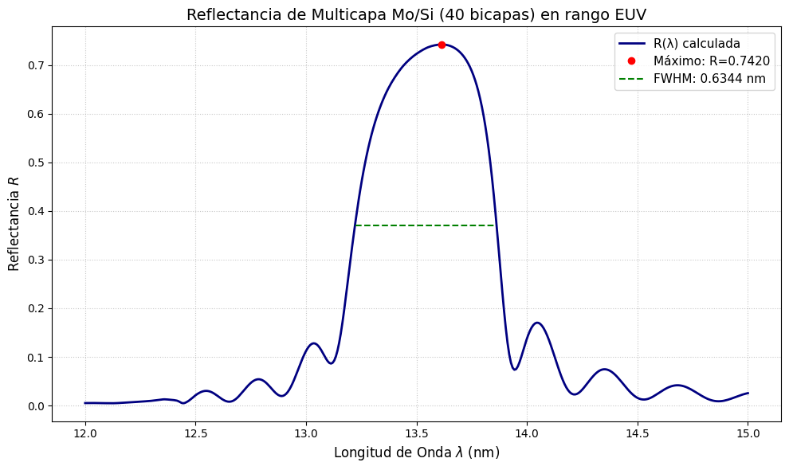
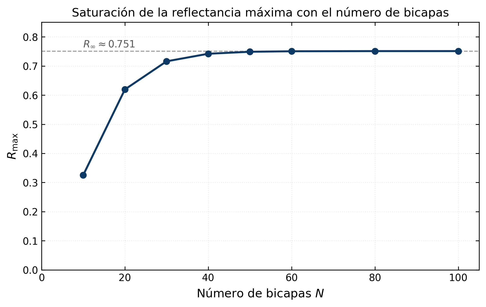

# FIS223 — Óptica Moderna y Espectroscopía

Tarea de análisis numérico del curso **FIS223 (Óptica Moderna y Espectroscopía)**.

**Dependencias:** `numpy`, `matplotlib` (ver `requirements.txt` en la raíz del repositorio).

---

## Tarea 4 — Espejo multicapa Mo/Si para el ultravioleta extremo (EUV)

[`Tarea_4/Tarea_4.ipynb`](./Tarea_4/Tarea_4.ipynb)

Cálculo de la reflectancia de un espejo de Bragg construido por apilamiento periódico de
bicapas de molibdeno y silicio, del tipo empleado en litografía EUV a 13.5 nm.

### Planteamiento

En el rango EUV **ningún material tiene reflectancia apreciable en incidencia normal**: los
índices de refracción son casi exactamente 1 y la absorción es alta. La solución es un espejo
de interferencia: apilar decenas de bicapas de espesor comparable a la longitud de onda, de
modo que las reflexiones parciales de cada intercara se sumen en fase.

El índice de refracción complejo se escribe en la convención habitual para rayos X blandos:

$$
n(\lambda) = 1 - \delta(\lambda) - i\beta(\lambda)
$$

donde $\delta$ y $\beta$ se obtuvieron de las tablas del **CXRO** (Center for X-Ray Optics) e
incluyen 400 puntos por material entre 12 y 15 nm. Los datos están incrustados directamente en
el notebook, de modo que se ejecuta sin depender de archivos externos.

### Método: matrices de transferencia

Cada capa homogénea de espesor $d$ se describe por su matriz característica en incidencia
normal:

$$
M = \begin{pmatrix}
\cos(\varphi) & \dfrac{i}{n}\sin(\varphi) \\
i n \sin(\varphi) & \cos(\varphi)
\end{pmatrix},
\qquad
\varphi = \frac{2\pi n d}{\lambda}
$$

La matriz de una bicapa es $M_{\text{bicapa}} = M_{\text{Mo}} M_{\text{Si}}$, y la del
apilamiento completo de $N$ bicapas es $M_{\text{bicapa}}^{N}$, calculada con
`numpy.linalg.matrix_power`. De sus elementos se obtiene el coeficiente de reflexión:

$$
r = \frac{n_0(m_{11} + n_s m_{12}) - (m_{21} + n_s m_{22})}{n_0(m_{11} + n_s m_{12}) + (m_{21} + n_s m_{22})}, \qquad R = |r|^2
$$

con $n_0 = 1$ (aire) y $n_s$ el índice del sustrato semi-infinito de silicio.

**Parámetros del diseño:** $d_{\text{Mo}} = 2.79$ nm, $d_{\text{Si}} = 4.18$ nm (período
$\Lambda = 6.97$ nm), $N = 40$ bicapas.

### Resultados

| Magnitud | Valor |
|---|---|
| Reflectancia máxima | $R_{\max} = 0.7420$ (74.20%) |
| Longitud de onda del pico | $\lambda_{\max} = 13.61$ nm |
| Ancho de banda | FWHM $= 0.634$ nm |

La curva reproduce el comportamiento esperado de un espejo de Bragg: un pico de reflectancia
intenso y estrecho, flanqueado por lóbulos laterales de amplitud mucho menor (máximo ~0.17,
bastante por debajo del medio máximo 0.371, lo que permite medir el FWHM directamente sobre la
curva).

El pico aparece en 13.61 nm, algo por debajo del valor $2\Lambda = 13.94$ nm que daría la
condición de Bragg en el vacío. El corrimiento se debe a que el índice medio del apilamiento es
ligeramente **menor** que 1 en el EUV, de modo que la longitud de onda efectiva dentro del
material difiere de la del vacío.

### Saturación con el número de bicapas

Se repitió el cálculo variando $N$ para determinar cuántas bicapas tiene sentido depositar:

| $N$ | 10 | 20 | 30 | 40 | 50 | 60 | 80 | 100 |
|---|---|---|---|---|---|---|---|---|
| $R_{\max}$ | 0.3256 | 0.6195 | 0.7161 | 0.7420 | 0.7488 | 0.7506 | 0.7511 | 0.7512 |

La reflectancia **satura** en $R_\infty \approx 0.751$. La causa es la absorción: el molibdeno
tiene $\beta \neq 0$, de modo que la radiación se atenúa a medida que penetra en el apilamiento
y las bicapas más profundas dejan de recibir intensidad apreciable. A partir de unas 50 bicapas,
agregar más capas no aporta reflectancia — solo costo de fabricación. Con $N = 40$ ya se alcanza
el 98.8% del valor asintótico.

> **Nota de lectura del código.** El notebook emplea las dos convenciones de signo habituales
> para el índice complejo: $n = 1-\delta-i\beta$ con matrices en $+i$ en el cálculo principal, y
> $n = 1-\delta+i\beta$ con matrices en $-i$ en la función del barrido. Ambas corresponden a
> las convenciones temporales $e^{-i\omega t}$ y $e^{+i\omega t}$, son conjugadas entre sí y
> producen idéntico $|r|^2$ — como confirma que ambos bloques den $R_{\max} = 0.7420$ para
> $N = 40$.

---

## Contacto

Si encuentras algún error o tienes preguntas sobre el desarrollo, puedes abrir un *Issue* en
este repositorio.
