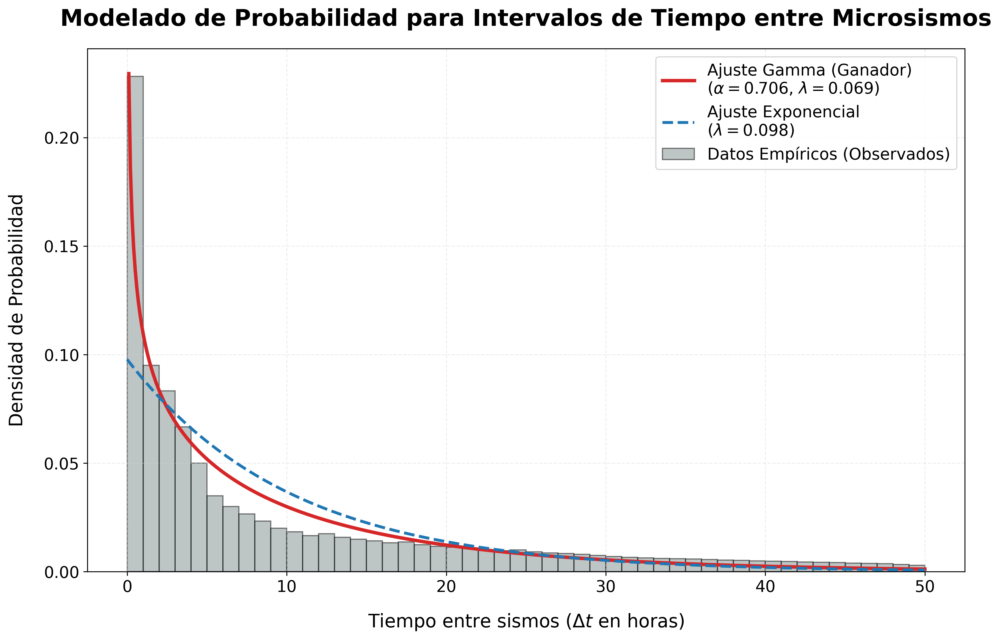
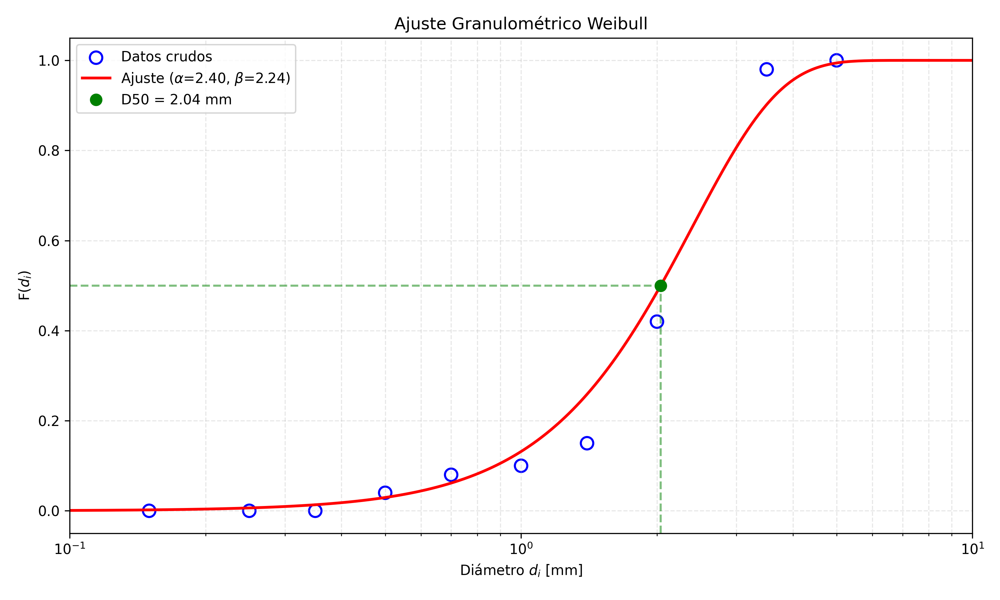
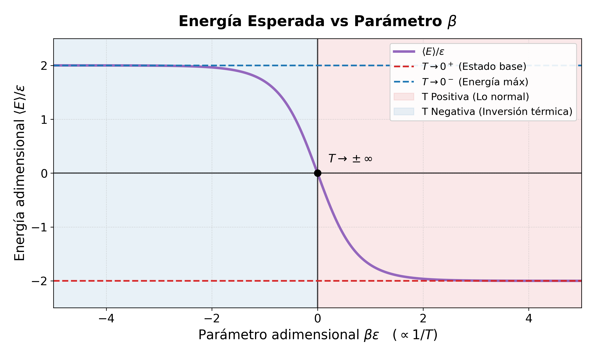
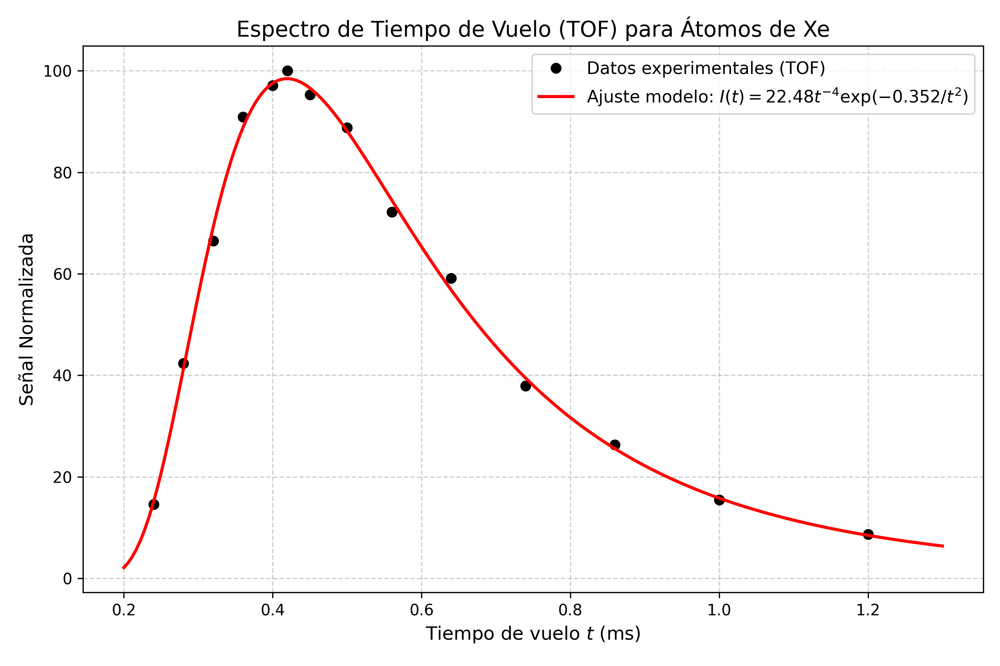

# FIS230 — Termodinámica y Mecánica Estadística

Ejercicios con desarrollo numérico y análisis de datos del curso **FIS230 (Termodinámica y
Mecánica Estadística)**. El curso es de cátedra; aquí se publican únicamente las tareas que
requirieron cálculo computacional.

> ✅ **Reproducibilidad:** todos los scripts traen sus datos escritos dentro del propio código y
> se ejecutan sin depender de archivos externos. Las figuras de abajo se generan al correrlos.

**Dependencias:** `numpy`, `scipy`, `matplotlib` (ver `requirements.txt` en la raíz del repositorio).

---

## Tarea 1

### Ejercicio 1 — Modelado estadístico de intervalos entre microsismos

[`Tarea_1/Ejercicio_1.py`](./Tarea_1/Ejercicio_1.py)

Ajuste de dos modelos de probabilidad a los tiempos de espera entre microsismos consecutivos,
a partir de una tabla de frecuencias agrupada en 50 intervalos de una hora.

**Estimación por el método de los momentos.** A partir de la media y la varianza muestrales:

$$
\lambda_\Gamma = \frac{\mu}{\sigma^2}, \qquad
\alpha_\Gamma = \frac{\mu^2}{\sigma^2}, \qquad
\lambda_{\exp} = \frac{1}{\mu}
$$

**Resultados sobre la muestra** ($N = 5999$ sismos, $\mu = 10.23$ h, $\sigma^2 = 148.17$ h²):

| Modelo | Parámetros | $P(t < 5\text{ h})$ | SSE |
|---|---|---|---|
| Gamma | $\alpha = 0.7062$, $\lambda = 0.0690$ | 45.19% | 205 592 |
| Exponencial | $\lambda = 0.0978$ | 38.66% | 783 985 |

**Interpretación física.** La Gamma ajusta casi cuatro veces mejor en suma de errores
cuadrados, y el motivo está en el valor del parámetro de forma: $\alpha = 0.706 < 1$.

Para una distribución Gamma con $\alpha < 1$ la tasa de riesgo es **decreciente**: cuanto más
tiempo ha pasado desde el último evento, menos probable resulta el siguiente. Es decir, los
sismos **no ocurren de forma independiente, sino agrupados en ráfagas** — el comportamiento
característico de las réplicas sísmicas.

La distribución exponencial, en cambio, describe un proceso de Poisson sin memoria, con tasa de
riesgo constante. Que ajuste peor es precisamente la evidencia de que el fenómeno tiene memoria.

---

### Ejercicio 2 — Ajuste granulométrico con distribución de Weibull

[`Tarea_1/Ejercicio_2.py`](./Tarea_1/Ejercicio_2.py)

Caracterización de la distribución de tamaños de partícula de un material granular mediante la
función de distribución acumulada de Weibull:

$$
F(d) = 1 - \exp\left[-\left(\frac{d}{\alpha}\right)^{\beta}\right]
$$

**Linealización.** Aplicando logaritmo dos veces, la Weibull se convierte en una recta, lo que
permite obtener los parámetros por regresión lineal simple:

$$
\ln\left[-\ln(1 - F)\right] = \beta \ln d - \beta \ln \alpha
$$

de modo que la pendiente entrega directamente $\beta$, y el intercepto $b$ da la escala mediante
$\alpha = e^{-b/\beta}$.

**Resultados:**

| Magnitud | Valor |
|---|---|
| Parámetro de forma | $\beta = 2.2351$ |
| Parámetro de escala | $\alpha = 2.4014$ mm |
| Calidad del ajuste | $R^2 = 0.9305$ |
| Diámetro mediano | $D_{50} = \alpha(\ln 2)^{1/\beta} = 2.0382$ mm |

> **Nota sobre los datos empleados.** El gráfico muestra los diez puntos observados, pero la
> regresión utiliza solo seis. Los puntos con $F = 0$ y $F = 1$ quedan necesariamente fuera: la
> transformación requiere $\ln(-\ln(1-F))$, que diverge en ambos extremos. Es una limitación
> intrínseca del método de linealización, no un descarte arbitrario.

---

## Tarea 2

### Ejercicio 1 — Energía media de un sistema de tres niveles y temperaturas negativas

[`Tarea_2/Ejercicio_1.py`](./Tarea_2/Ejercicio_1.py)

Estudio de la energía interna media de un sistema de tres niveles no degenerados con energías
$\lbrace -2\varepsilon, 0, +2\varepsilon \rbrace$, y de su comportamiento en el régimen de
temperaturas negativas.

**Función de partición y energía media:**

$$
Z = e^{2\beta\varepsilon} + 1 + e^{-2\beta\varepsilon} = 2\cosh(2\beta\varepsilon) + 1
$$

$$
\langle E \rangle = -\frac{\partial \ln Z}{\partial \beta}
= \frac{-4\varepsilon \sinh(2\beta\varepsilon)}{2\cosh(2\beta\varepsilon) + 1}
$$

**Los tres regímenes de la curva:**

| Régimen | $\beta\varepsilon$ | $\langle E \rangle / \varepsilon$ | Situación física |
|---|---|---|---|
| $T \to 0^{+}$ | $\to +\infty$ | $\to -2$ | Todas las partículas en el estado fundamental |
| $T \to \pm\infty$ | $\to 0$ | $\to 0$ | Los tres niveles igualmente poblados |
| $T \to 0^{-}$ | $\to -\infty$ | $\to +2$ | Inversión total de población |

**Temperaturas negativas.** El sistema tiene un espectro de energía **acotado por arriba**, y
esa es la condición que permite que $T < 0$ tenga sentido. En esa región la población del nivel
superior excede la del inferior; es el estado que sostiene la emisión estimulada en un láser.
Contra la intuición, una temperatura negativa es *más caliente* que cualquier temperatura
positiva: el sistema cede energía a cualquier cuerpo con $T > 0$ con el que se ponga en contacto.

---

## Tarea 6

### Ejercicio 1 — Espectro de tiempo de vuelo de átomos de xenón

[`Tarea_6/Ejercicio_1.py`](./Tarea_6/Ejercicio_1.py)

Ajuste no lineal de un espectro de tiempo de vuelo (TOF) para un haz de átomos de xenón.

**Modelo ajustado:**

$$
I(t) = C t^{-4} \exp\left(-\frac{b}{t^{2}}\right)
$$

Esta forma proviene de la distribución de rapideces de Maxwell–Boltzmann. Para un detector
sensible a densidad, la señal escala como $I \propto v^{4}e^{-mv^{2}/2k_BT}$; sustituyendo
$v \propto 1/t$ se obtiene directamente la dependencia $t^{-4}e^{-b/t^{2}}$. El parámetro $b$
concentra la información térmica del haz: es proporcional a $mL^{2}/2k_BT$, con $L$ la distancia
de vuelo.

**Resultados del ajuste** (`scipy.optimize.curve_fit` sobre 14 puntos experimentales):

| Parámetro | Valor |
|---|---|
| $C$ | $22.48 \pm 0.37$ |
| $b$ | $0.3516 \pm 0.0027$ ms² |
| $R^2$ | 0.9979 |

Las incertidumbres se obtienen de la raíz de la diagonal de la matriz de covarianza que devuelve
`curve_fit`. El ajuste reproduce el 99.79% de la varianza de los datos, incluyendo la asimetría
característica del espectro: subida abrupta y cola larga hacia tiempos altos.

---

## Contacto

Si encuentras algún error o tienes preguntas sobre alguno de los ejercicios, puedes abrir un
*Issue* en este repositorio.
