# ICF130 — Fundamentos de la Termodinámica

Tareas, análisis de laboratorio y el proyecto de simulación desarrollados para el curso
**ICF130 (Fundamentos de la Termodinámica)**. Cada sección incluye los scripts relevantes y una
descripción de su objetivo.

**Dependencias:** `numpy`, `scipy`, `matplotlib`, `pandas` (ver `requirements.txt` en la raíz
del repositorio).

---

## 🔹 Tareas

### Tarea 1: Simulación de Dinámica de Fluidos

Este script modela la dinámica de la altura (`h`) de un fluido en un depósito cilíndrico. El sistema está sujeto a múltiples flujos de entrada y salida, algunos constantes, otros variables con el tiempo y otros dependientes de la altura del fluido.

El script principal se encuentra en: [`simulacion_deposito_fluido.py`](./Tarea_1/simulacion_deposito_fluido.py)

**Lógica del Script:**
1.  **Modelo Físico:** Define una Ecuación Diferencial Ordinaria (EDO) basada en la ley de continuidad para el depósito: $dh/dt = (Q_{\text{in}} - Q_{\text{out}}) / A_{\text{tanque}}$.
2.  **Flujos Complejos:** Los caudales (flujos) son no lineales:
    * $Q_A$ depende de $\sqrt{2 - h^4}$.
    * $Q_B$ varía con el tiempo, $\propto \cos(\pi t)$.
    * $Q_D$ (salida) sigue la ley de Torricelli, $\propto \sqrt{h}$.
3.  **Solución Numérica:** Utiliza `scipy.integrate.solve_ivp` con un método Runge-Kutta (RK45) para resolver la EDO y encontrar la función $h(t)$ para un estado inicial $h_0 = 0.5$ m.
4.  **Visualización:** Genera un gráfico de $h(t)$ vs. Tiempo, mostrando la evolución de la altura del fluido.

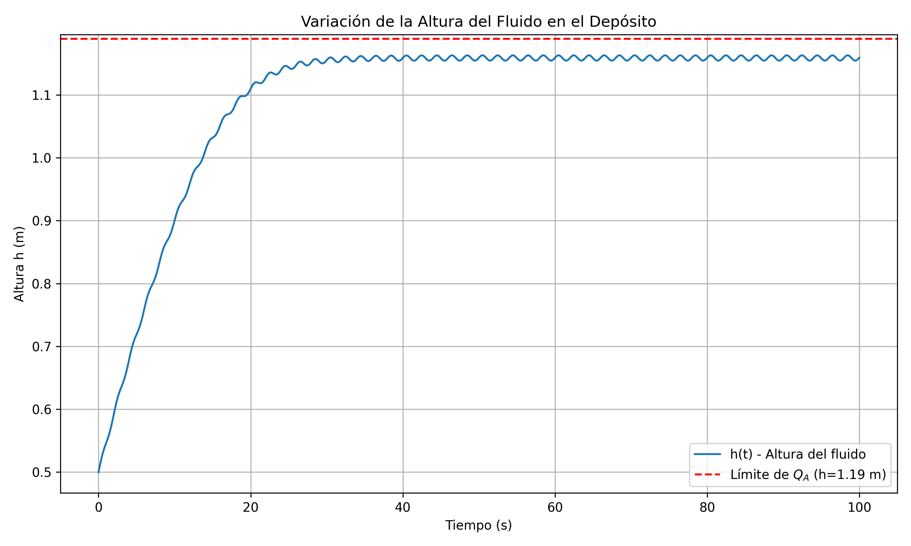


---

## 🔹 C1 Numérico: Análisis de Ciclo Termodinámico

Este proyecto corresponde a la parte numérica del Certamen 1. El script de Python analiza un ciclo termodinámico de 5 etapas para un mol de un gas diatómico, comparando el comportamiento de un **Gas Ideal (IG)** con un **Gas de Van der Waals (VdW)**.

El script principal se encuentra en: [`analisis_ciclo_termo.py`](./C1_Numerico/analisis_ciclo_termo.py)

### 🧠 Lógica del Script

El análisis se realiza en cuatro etapas principales:

**1. Ajuste de Parámetros VdW**
* Utiliza `scipy.optimize.least_squares` para ajustar los parámetros `a` y `b` de la ecuación de Van der Waals a un conjunto de datos experimentales sintéticos (P, V, T).
* Calcula los intervalos de confianza y la métrica de ajuste R² para validar el modelo.

**2. Cálculo de Estados del Ciclo**
* Define un ciclo de 5 estados (1→2 adiabático, 2→3 isocórico, 3→4 isotermo, 4→5 isobárico, 5→1 isocórico).
* Resuelve analíticamente los estados para el Gas Ideal.
* Utiliza `scipy.optimize.fsolve` para resolver el sistema de ecuaciones no lineales (termodinámicas y de estado VdW) y encontrar las coordenadas (T, P, V) en cada estado para el modelo de Van der Waals.

**3. Análisis Termodinámico (W, Q, η)**
* Calcula el Trabajo (W) y el Calor (Q) para cada una de las 5 etapas del ciclo, tanto para IG como para VdW.
* Para VdW, el trabajo en procesos no isocóricos se calcula integrando numéricamente $P(T, V) dV$ usando `np.trapezoid`.
* Suma los valores para obtener el Trabajo Neto (`W_net`) y el Calor Neto (`Q_net`).
* Calcula la eficiencia térmica ($\eta = W_{net} / Q_{in}$) del ciclo para ambos modelos.

**4. Visualización Comparativa**
* Utiliza `matplotlib` para generar gráficos P-V y T-V.
* Superpone las curvas del ciclo para el Gas Ideal y el Gas de Van der Waals, permitiendo una comparación visual directa de las desviaciones del comportamiento ideal.

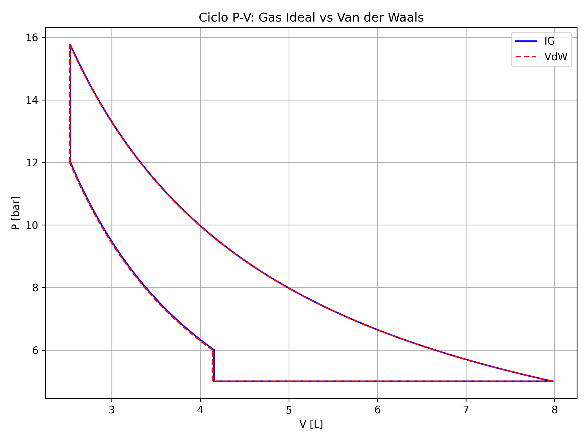

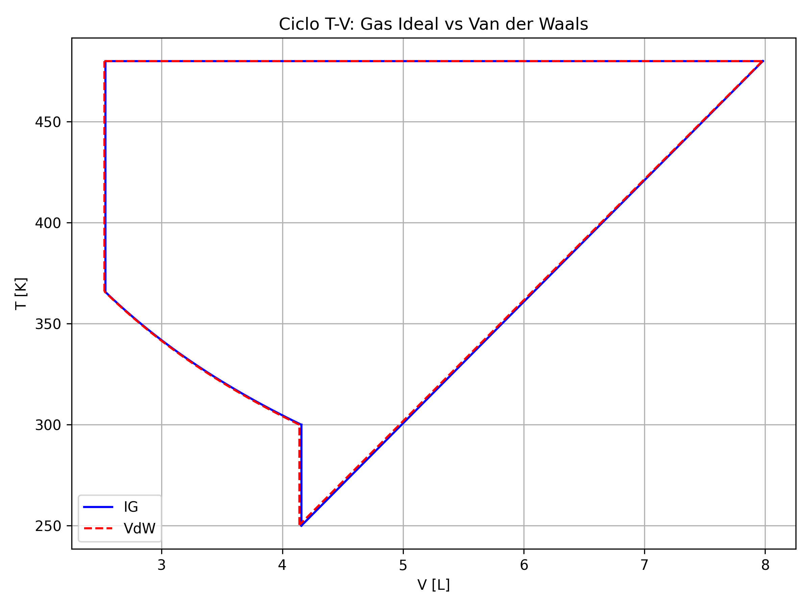

**Resultados:**

| Modelo | $W_{neto}$ [bar·L] | $Q_{neto}$ [bar·L] | Eficiencia |
|---|---|---|---|
| Gas ideal | 13.0119 | 13.0119 | $\eta = 0.1628$ |
| Van der Waals | 13.0745 | 13.0533 | $\eta = 0.1637$ |

**Dos verificaciones que ofrece la tabla.** Para un ciclo cerrado el primer principio exige
$W_{neto} = Q_{neto}$, ya que $\Delta U = 0$ al volver al estado inicial. El gas ideal lo cumple
de forma exacta porque sus etapas se resuelven analíticamente; Van der Waals difiere en un
0.16%, que corresponde al error de la integración numérica de $\int P dV$ en las etapas no
isocóricas. Ese residuo es, en la práctica, un indicador de la precisión del método.

> **Sobre el ajuste de los parámetros de Van der Waals.** El ajuste alcanza $R^2 = 0.9991$, pero
> los intervalos de confianza al 95% resultan $a = 0.773 \pm 4.357$ y $b = 0.0153 \pm 0.1613$:
> las incertidumbres superan a los valores en un factor de 6 y 10 respectivamente. Es el
> síntoma clásico de una fuerte correlación entre ambos parámetros — los datos determinan bien
> la *curva*, pero no cada parámetro por separado. Un $R^2$ alto no garantiza parámetros bien
> determinados.

---

### 🛠️ Bibliotecas y Ejecución

El script requiere `numpy`, `matplotlib` y `scipy`.

1.  **Instalación (si es necesario):**
    ```bash
    pip install numpy matplotlib scipy
    ```

2.  **Ejecución:**
    Simplemente ejecuta el script en una terminal desde la carpeta `C1_Numerico`:
    ```bash
    python analisis_ciclo_termo.py
    ```

3.  **Resultados:**
    El script imprimirá en la consola:
    * Los parámetros `a` y `b` de VdW ajustados.
    * Tablas con los valores de (T, P, V) para cada estado (IG y VdW).
    * Tablas con los valores de W y Q para cada proceso (IG y VdW).
    * Los valores netos y la eficiencia (η) de ambos modelos.
    * Mostrará las ventanas de `matplotlib` con los gráficos P-V y T-V.
  
    
---

## 🔹 Laboratorios

Scripts de análisis para los laboratorios del curso.

### Laboratorio 1: Termómetro de Gas y Ley de Gas Ideal

Este script analiza los datos de un experimento de termómetro de gas a volumen constante, comparando su comportamiento con la ley de gas ideal.

El script principal se encuentra en: [`analisis_termometro_gas.py`](./Laboratorio/analisis_termometro_gas.py)

**Lógica del Script:**
1.  **Calibración PT100:** Realiza un ajuste lineal (`scipy.stats.linregress`) a los datos de (T, R) para calibrar el sensor PT100 y obtener su $R_0$ y $\alpha$.
2.  **Cálculo de Presión:** Convierte las mediciones de altura de la columna de mercurio (`h_mercurio`) a Presión (Pa), usando la densidad del mercurio y la presión atmosférica.
3.  **Comparación (Ley de Gay-Lussac):** Calcula la presión teórica (`P_ideal`) que el gas debería tener en cada temperatura si siguiera la ley de gas ideal ($P \propto T$).
4.  **Visualización:** Genera 3 gráficos comparativos, incluyendo `R vs T` (calibración) y `P_medida vs P_ideal` (verificación de la ley).

**Resultados de la calibración del PT100:**

| Magnitud | Valor |
|---|---|
| Resistencia a 0 °C | $R_0 = 100.22 \pm 0.16\ \Omega$ |
| Coeficiente térmico | $\alpha = 0.00369 \pm 0.00003$ °C⁻¹ |
| Calidad del ajuste | $R^2 = 0.9995$ |

El valor de $R_0$ coincide con el nominal de un PT100 (100 Ω) dentro de la incertidumbre, y
$\alpha$ queda a un 4% del valor estándar de 0.00385 °C⁻¹.

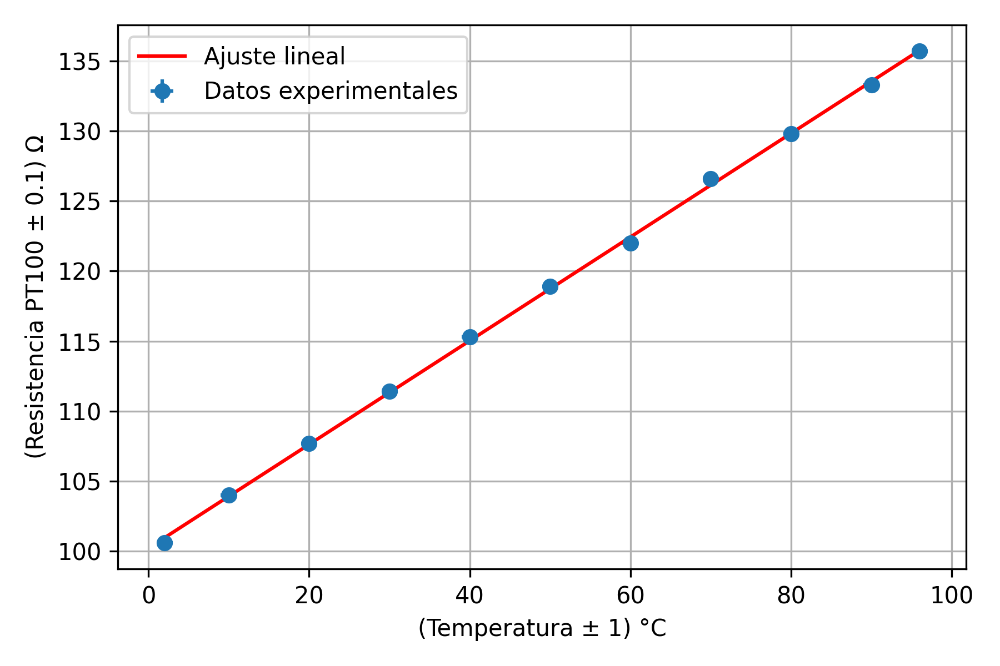

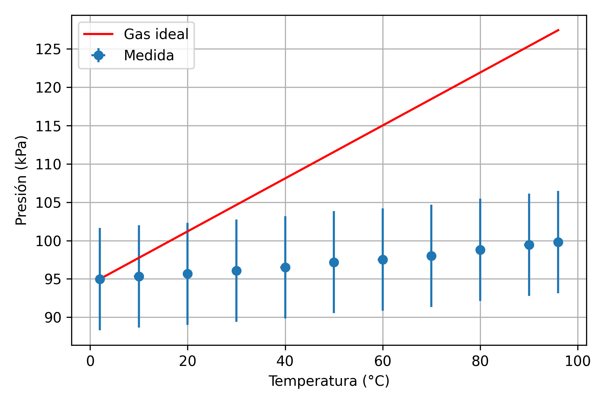

### Laboratorio 2: Calores Latentes de Fusión y Vaporización

Estos scripts analizan los datos de un calorímetro eléctrico para determinar los calores latentes de fusión y vaporización del agua.

**Parte 1: Calor Latente de Fusión ($L_f$)**
* **Script:** [`analisis_calor_fusion.py`](./Laboratorio/analisis_calor_fusion.py)
* **Lógica:** Determina $L_f$ midiendo la energía eléctrica ($Q = V \cdot I \cdot t$) suministrada durante la meseta de fusión (0°C) para una masa de hielo conocida ($L_f = Q / m_{\text{hielo}}$).

**Parte 2: Calor Latente de Vaporización ($L_v$)**
* **Script:** [`analisis_calor_vaporizacion.py`](./Laboratorio/analisis_calor_vaporizacion.py)
* **Lógica:** Determina $L_v$ midiendo la energía suministrada durante la meseta de ebullición ($\Delta Q$) y dividiéndola por la masa de agua evaporada ($\Delta m_{\text{evap}}$) durante ese tiempo ($L_v = \Delta Q / \Delta m_{\text{evap}}$).

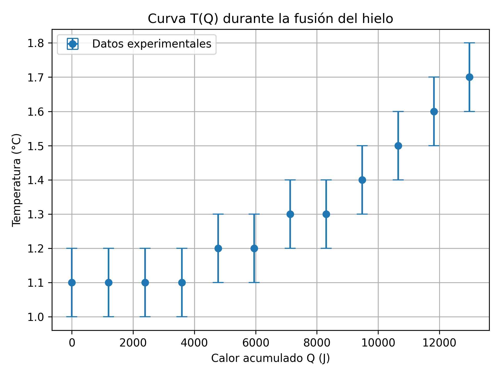

**Resultados y limitaciones de estas dos experiencias:**

| | Resultado | Valor tabulado | Diferencia |
|---|---|---|---|
| Fusión | $L_f = 257.5 \pm 1.5$ kJ/kg | 334 kJ/kg | 22.9% |
| Vaporización | *no calculable* | 2256 kJ/kg | — |

**Fusión.** La serie registrada permanece entre 1.1 y 1.7 °C durante los once minutos, de modo
que no se distingue una meseta de fusión separada del calentamiento posterior del agua. Al
atribuir toda la energía suministrada al cambio de fase, $L_f$ resulta subestimado. La
diferencia del 23% respecto del valor tabulado es consecuencia de esa limitación experimental,
no del análisis.

**Vaporización.** El calor entregado durante la meseta ($\Delta Q = 8696$ J) sí quedó medido,
pero **la masa de agua evaporada no se registró**, y sin ella $L_v = \Delta Q/\Delta m$ no puede
obtenerse. El script reporta el $\Delta Q$ medido y deja el cálculo pendiente en lugar de
completarlo con un valor supuesto. Como referencia, el valor tabulado implicaría una masa
evaporada de aproximadamente 3.9 g.

---

### Laboratorio 3: Rendimiento de una bomba de calor

📓 [`Laboratorio_3/laboratorio_3_bomba_de_calor.ipynb`](./Laboratorio/Laboratorio_3/laboratorio_3_bomba_de_calor.ipynb)

**Autores:** Ignacio Díaz · Flavia Pedraza

Se mide el desempeño de un compresor que transfiere calor entre dos depósitos de agua: el foco
frío se enfría de 22 a 10 °C y el foco caliente se calienta de 21 a 36 °C, mientras se registra
la potencia eléctrica consumida.

$$
Q_2 = m c_p \Delta T_2, \qquad W_{elec} = P \Delta t, \qquad \eta_{co} = \frac{Q_2}{W_{elec}}
$$

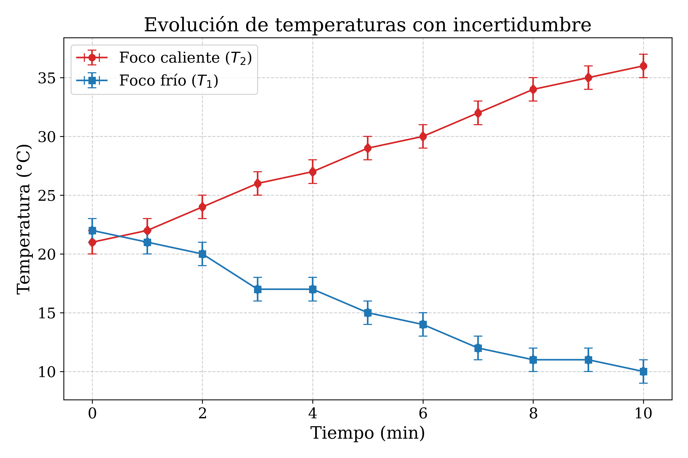

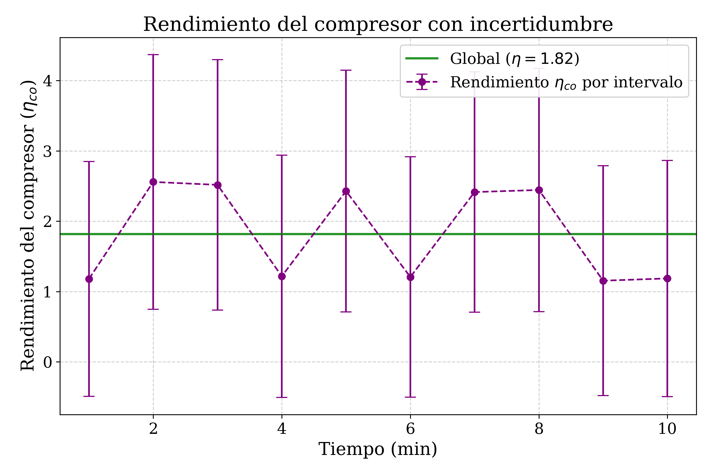

**Resultado:** $\eta_{co} = 1.82 \pm 0.17$ (9.4%).

**Interpretación.** Que $\eta$ supere la unidad es lo esperado: no se trata de una eficiencia
acotada por 1, sino de un **coeficiente de desempeño**. La máquina no crea energía, la
transporta desde el foco frío al caliente. El límite de Carnot al final del ensayo es
$T_2/(T_2-T_1) = 11.9$, muy por encima del valor medido, como corresponde a una máquina real
con irreversibilidades.

**Sobre las incertidumbres por intervalo.** El rendimiento global es mucho más confiable que los
valores tramo a tramo: en cada minuto el foco caliente sube apenas 1 o 2 °C, comparable a la
resolución del termómetro, de modo que el error relativo por intervalo llega al 70–140%. En
cambio, el cálculo global usa el salto total de 15 °C y queda en 9.4%. Es un buen recordatorio
de que promediar razones ruidosas no equivale a la razón de los totales.

---

## 🔹 Trabajo de Simulación: conducción de calor transitoria en 2D

📓 [`Trabajo_de_Simulacion/conduccion_calor_2d.ipynb`](./Trabajo_de_Simulacion/conduccion_calor_2d.ipynb)

**Autores:** Ignacio Díaz · Flavia Pedraza

Estudio de la evolución de la temperatura en una placa rectangular de acero, comparando la
**solución analítica** por separación de variables con un **solver numérico** de diferencias
finitas explícitas (FTCS), y evaluando el efecto de una fuente de calor interna.

$$
\frac{\partial T}{\partial t} = \alpha\left(\frac{\partial^2 T}{\partial x^2} + \frac{\partial^2 T}{\partial y^2}\right) + \frac{\dot{q}}{\rho c_p}, \qquad \alpha = \frac{k}{\rho c_p}
$$

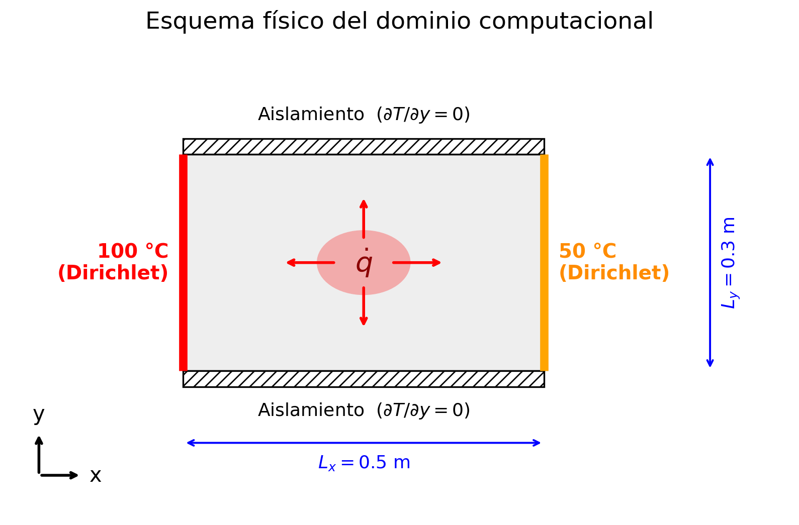

### Solución analítica

Los bordes horizontales son adiabáticos y la condición inicial es uniforme, de modo que el
problema 2D **se reduce exactamente al problema 1D en $x$**. La solución se separa en el estado
estacionario más una parte transitoria que decae:

$$
T(x,t) = T_{ss}(x) + \sum_{n=1}^{\infty} b_n \sin\left(\frac{n\pi x}{L_x}\right) e^{-\alpha (n\pi/L_x)^2 t}
$$

Como la condición inicial transitoria es una función lineal de $x$, los coeficientes $b_n$
tienen **forma cerrada** y no requieren cuadratura numérica.

### Efecto de la fuente interna

Se resuelve el problema en dos escenarios —sin fuente (Caso A) y con
$\dot{q} = 5\times10^5$ W/m³ (Caso B)— y se resta uno del otro para aislar el calentamiento
atribuible únicamente a la fuente.

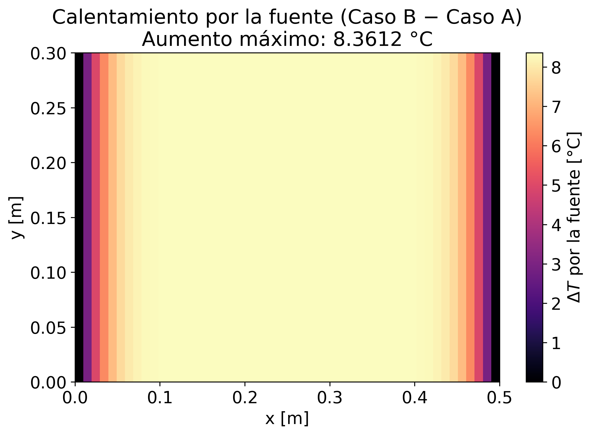

El aumento máximo tras 60 s resulta de **8.3612 °C**, que coincide exactamente con la cota
adiabática $\dot{q} t/(\rho c_p)$. La razón es que la diferencia entre ambos casos obedece la
misma ecuación del calor con la fuente como único término y condiciones nulas en los bordes de
Dirichlet: crece de forma puramente adiabática mientras la difusión no alcance el centro. En
60 s el calor penetra apenas 2.7 cm desde los bordes, frente a los 25 cm que los separan del
centro de la placa.

### Verificación y convergencia

| Magnitud | Valor |
|---|---|
| Malla base | 51 × 31 nodos, $\Delta x = \Delta y = 0.01$ m |
| Paso temporal | $\Delta t = 1.794$ s |
| Número de Fourier | $Fo = 0.45$ (límite de estabilidad: 0.5) |
| Orden de convergencia observado | **1.940** (teórico: 2) |

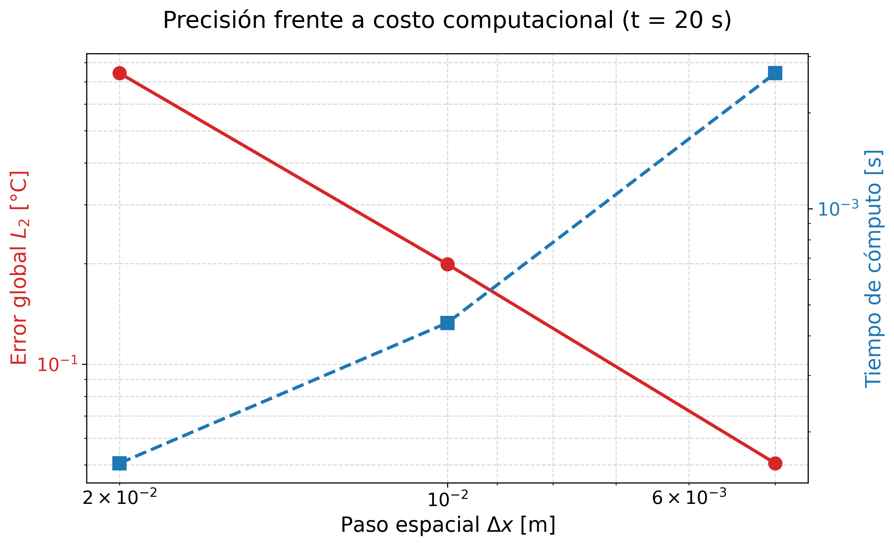

La condición de estabilidad de von Neumann para el esquema explícito en dos dimensiones es

$$
\alpha \Delta t \left(\frac{1}{\Delta x^2} + \frac{1}{\Delta y^2}\right) \le \frac{1}{2}
$$

El límite es $1/2$ y no $1$: cada dirección aporta su propio término y el peor modo de Fourier
los suma. Como $\Delta t$ estable escala con $\Delta x^2$, refinar el espacio encarece el
cálculo rápidamente — ese es el compromiso que muestra la figura.

### Análisis paramétricos

Sensibilidad de la evolución transitoria a la difusividad térmica ($\pm 50\%$) y al valor de la
fuente interna:

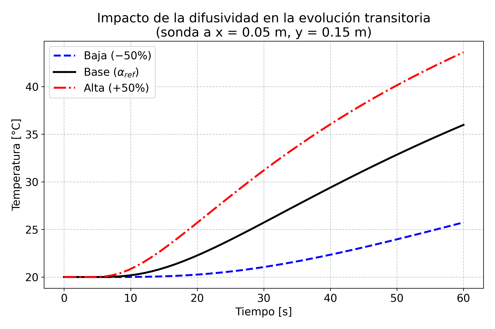

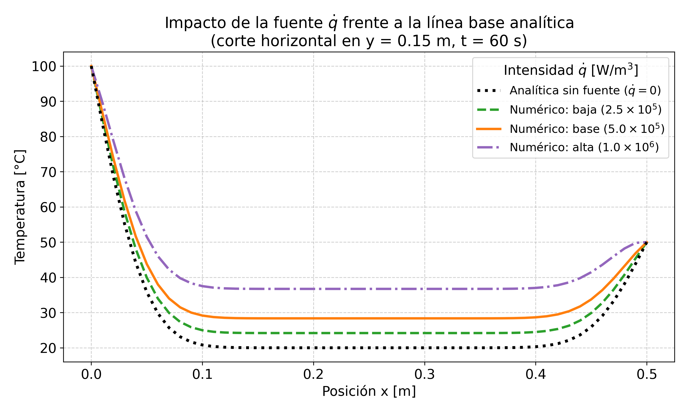

---
