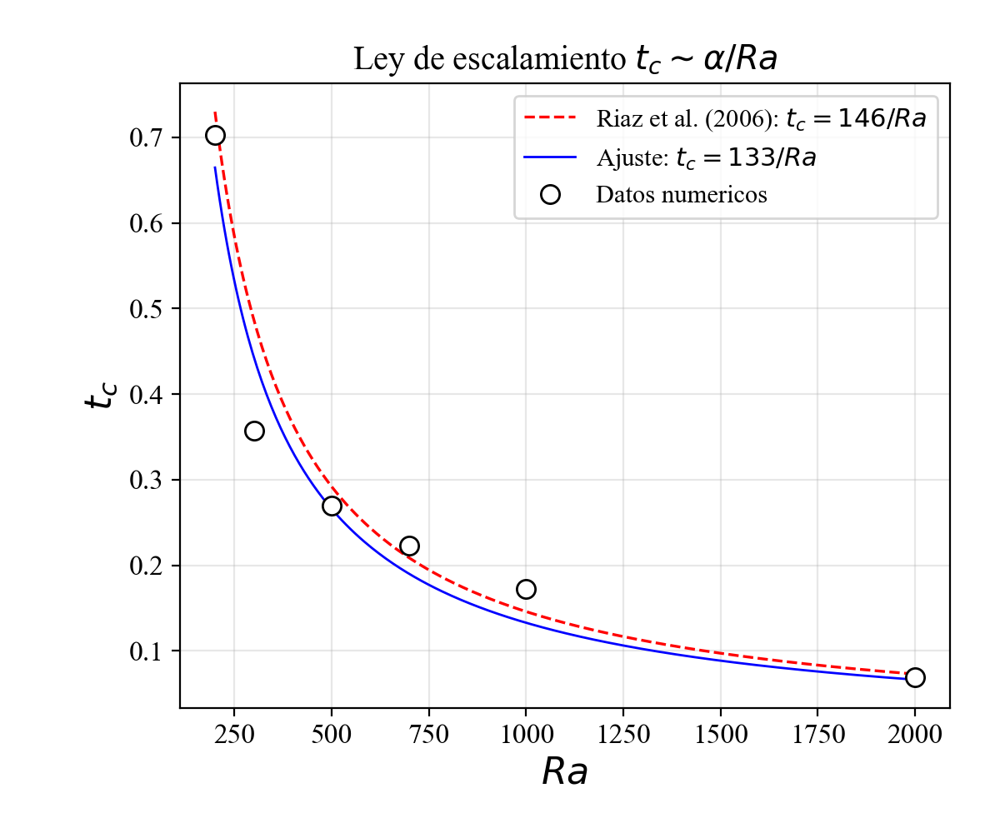
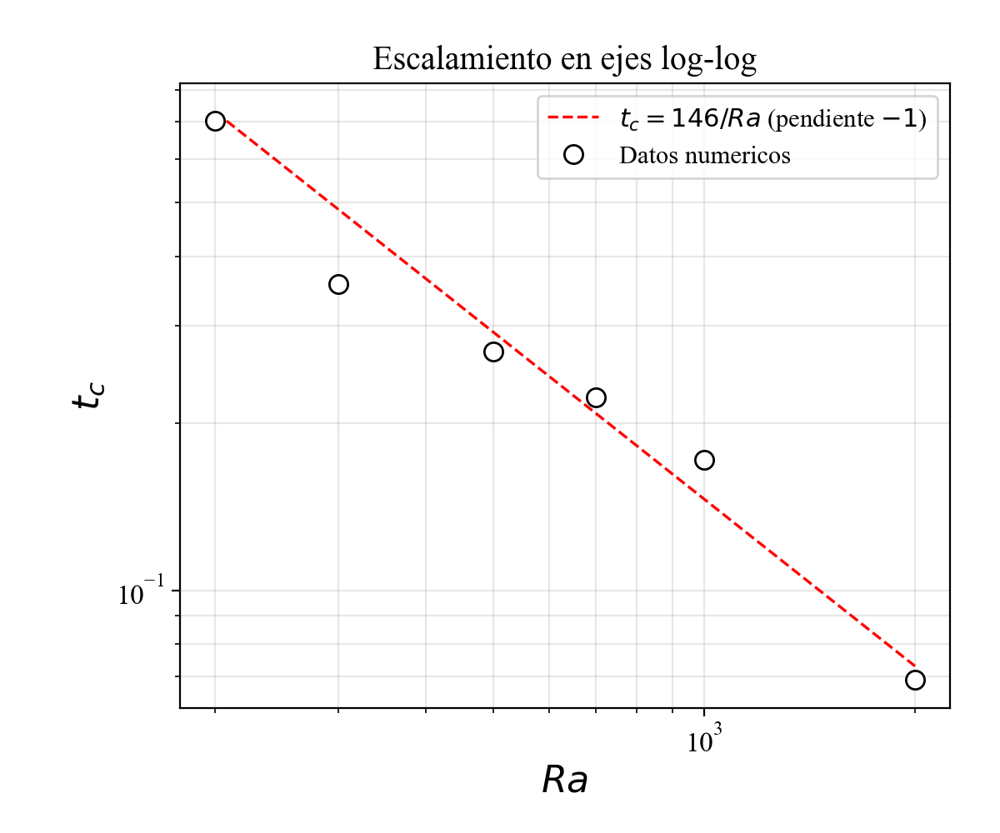

# ICF140 — Mecánica de Fluidos

Proyecto numérico del curso **ICF140 (Mecánica de Fluidos)**, desarrollado en tres fases:
**transporte no lineal en 2D e inestabilidad de Rayleigh–Taylor en un medio poroso**.

**Autores:** Ignacio Díaz · Flavia Pedraza

---

## Contexto

El proyecto estudia el transporte de masa de una mezcla de fluidos miscibles en un medio
poroso, donde una capa densa sobre otra menos densa desencadena la **inestabilidad de
Rayleigh–Taylor**, generando plumas convectivas que aceleran drásticamente la transferencia de
masa respecto de la difusión pura.

La aplicación directa es la **disolución de CO₂ en acuíferos salinos**, una de las estrategias
de almacenamiento geológico de carbono: cuando el CO₂ inyectado se disuelve en la salmuera,
la mezcla resultante es más densa que la salmuera pura, y el sistema se vuelve
convectivamente inestable. La rapidez con que ocurre esa convección determina la viabilidad
del almacenamiento a largo plazo.

> ⚠️ **Sobre el código de simulación.** El solver que resuelve el sistema numérico es código de
> investigación del profesor del curso, y no forma parte de este repositorio ni es de nuestra
> autoría. Lo que se publica aquí es **la derivación matemática completa del método** (Fases 1
> y 2) y **el análisis de los resultados** obtenidos al ejecutarlo (Fase 3).

---

## Fase 1 — Modelo continuo y reducción analítica

[`Fase1.ipynb`](./Fase1.ipynb)

**Ecuaciones de gobierno** (aproximación de Boussinesq en medio poroso): incompresibilidad,
ley de Darcy, advección–difusión y ecuación de estado lineal en la concentración.

**Adimensionalización.** Escalando con la altura del dominio $H$ y las escalas características
de velocidad, presión y tiempo, todo el sistema queda controlado por un único parámetro
adimensional: el **número de Rayleigh solutal $Ra$**, que decide si el transporte está dominado
por difusión molecular o por convección gravitacional.

**Formulación corriente–vorticidad.** Introduciendo la función de corriente $\psi$ con

$$
u = -\frac{\partial \psi}{\partial z}, \qquad w = \frac{\partial \psi}{\partial x}
$$

la incompresibilidad se satisface de forma idéntica (por simetría de las derivadas cruzadas), y
tomando el rotacional de la ecuación de Darcy se **elimina el campo de presión**, reduciendo el
sistema vectorial a una única ecuación elíptica escalar de Poisson:

$$
\nabla^2 \psi = -\omega
$$

**Método híbrido: espectral en $x$, diferencias finitas en $z$.** Expandiendo $\psi$ y $\omega$
en series de senos a lo largo de $x$ —lo que satisface automáticamente las condiciones de
Dirichlet en $x=0$ y $x=L$— y usando la ortogonalidad de la base, la EDP bidimensional se
desacopla en una familia de EDOs independientes, una por cada número de onda $k$:

$$
\frac{d^2 F_k(z)}{dz^2} - \left(\frac{k\pi}{L}\right)^2 F_k(z) = -G_k(z)
$$

Esta es la ecuación de **Helmholtz 1D no homogénea**. La ganancia es sustancial: en lugar de
resolver un problema elíptico 2D acoplado, se resuelven problemas unidimensionales
independientes con precisión espectral en la dirección horizontal.

---

## Fase 2 — Discretización y ensamblaje del sistema lineal

[`Fase2.ipynb`](./Fase2.ipynb)

Traducción de la ecuación de Helmholtz a un sistema algebraico $\bar{P}\mathbf{u} = \mathbf{H}$,
usando **esquemas de diferencias finitas compactas de alto orden** cuyo ancho de plantilla se
adapta a la distancia al borde:

| Nodos | Esquema | Estructura |
|---|---|---|
| $p = 1$ y $p = J-1$ | Compacto de Padé, 3 puntos | Tridiagonal |
| $p = 2$ y $p = J-2$ | Compacto de 5 puntos | Pentadiagonal |
| $p = 3, \dots, J-3$ | Compacto de 7 puntos | Septadiagonal |

En cada caso se sustituye la relación $u''_p = \theta_p u_p - \psi_p$ en el esquema compacto y se
reagrupan los términos para identificar analíticamente los coeficientes de cada diagonal.

**Tratamiento de los bordes.** Los nodos fantasma $u_0$ y $u_J$ no pertenecen al vector de
incógnitas y se eliminan sustituyendo las condiciones de borde en las filas adyacentes, lo que
modifica los coeficientes de las tres primeras y las tres últimas filas de la matriz.

El resultado es una **matriz en banda septadiagonal** de dimensión $(J-1)\times(J-1)$, que
combina precisión de alto orden en el interior con un costo de resolución lineal en $J$.

---

## Fase 3 — Estabilidad lineal y ley de escalamiento

[`Fase3.ipynb`](./Fase3.ipynb)

**Análisis de estabilidad lineal.** Sobre un estado base de difusión pura $c_b(t,z)$ se
introducen perturbaciones en forma de ondas planas, $\propto e^{ikx}$, y se descartan los
productos entre perturbaciones. La ecuación de Poisson se reduce entonces a

$$
\frac{\partial^2 W}{\partial z^2} - k^2 W = k^2 c'
$$

que junto con la ecuación de transporte linealizada determina la tasa de crecimiento de cada
modo $k$. De ahí se construyen las **curvas de estabilidad neutra** en el plano $(t, k)$, cuyo
mínimo define el **tiempo crítico de inicio de la convección** $t_c$ para cada $Ra$.

### Ley de escalamiento

La teoría predice que el tiempo crítico escala inversamente con el número de Rayleigh,
$t_c = \alpha/Ra$. Los tiempos críticos obtenidos fueron:

| $Ra$ | 200 | 300 | 500 | 700 | 1000 | 2000 |
|---|---|---|---|---|---|---|
| $t_c$ | 0.703 | 0.357 | 0.270 | 0.223 | 0.172 | 0.069 |
| $t_c \cdot Ra$ | 140.6 | 107.1 | 135.0 | 156.1 | 172.0 | 138.0 |

### Validación contra la literatura

| Magnitud | Este trabajo | Referencia | Diferencia |
|---|---|---|---|
| Constante $\alpha$ | 132.95 | 146 (Riaz et al., 2006) | 8.9% |
| Exponente en log–log | −0.915 | −1 (teórico) | 8.5% |

El ajuste de $\alpha$ se hace por mínimos cuadrados forzando una recta por el origen sobre
$t_c$ frente a $1/Ra$.

**Lectura de los resultados.** El exponente medido de −0.915 confirma el escalamiento inverso
predicho, y la constante queda a menos de un 9% del valor publicado. Conviene notar, sin
embargo, que el producto $t_c \cdot Ra$ —que la ley predice constante— varía entre 107 y 172 a
lo largo del rango estudiado. La ley de escalamiento se cumple, por tanto, en sentido
asintótico y no punto a punto: es esperable, dado que $t_c$ se extrae del mínimo de una curva de
estabilidad neutra, un procedimiento sensible a la resolución del barrido en $k$ y en $t$.

---

## Referencia

Riaz, A., Hesse, M., Tchelepi, H. A. y Orr, F. M. (2006). *Onset of convection in a gravitationally
unstable diffusive boundary layer in porous media*. **Journal of Fluid Mechanics**, 548, 87–111.

---

## Contacto

Si encuentras algún error o tienes preguntas sobre el desarrollo, puedes abrir un *Issue* en
este repositorio.
