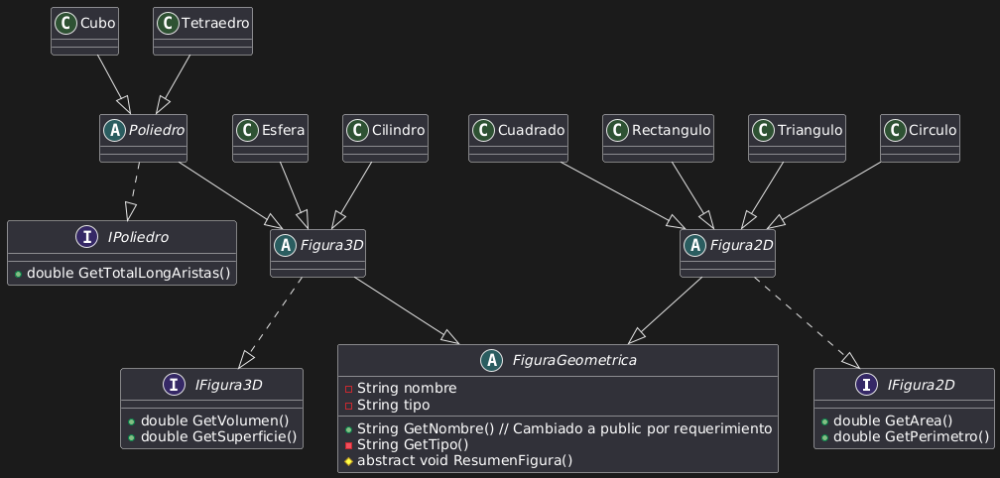

# INF230 — Programación Avanzada para las Ciencias

Las cuatro tareas del curso **INF230**, en tres lenguajes: **C++** (tareas 1 y 2), **Java**
(tarea 3) y **Scheme** (tarea 4). El énfasis del curso está en estructuras de datos,
programación orientada a objetos y programación funcional.

**Autores:** Ignacio Díaz · Flavia Pedraza

---

## Tarea 1 — Gestor de asistencia a un evento

📂 [`Tarea_1/`](./Tarea_1) · C++

Programa de consola que calcula cuántas personas —asistentes y empleados— se encuentran en un
evento a una hora determinada, combinando dos fuentes de datos con formatos distintos.

**Lectura de un archivo binario.** `flujo-asistentes.dat` almacena una cabecera con el número
de registros seguida de N estructuras `VariacionFlujo` (hora, minuto, variación neta). Se lee
en bloque con `read` sobre memoria reservada dinámicamente.

**Lectura de un archivo de texto.** `control-empleados.txt` registra entradas (`I`) y salidas
(`O`) por RUT. El programa mantiene el *último estado conocido* de cada empleado hasta la hora
consultada, y cuenta los que quedaron dentro.

**Ejecución:**

```bash
g++ -std=c++11 -o gestor gestor_asistencia.cpp
./gestor
```

Los dos archivos de datos deben estar en el mismo directorio que el ejecutable; ambos se
incluyen en esta carpeta.

**Verificación.** Los resultados se contrastaron con un cálculo de referencia independiente
sobre los mismos archivos, en cinco horas distintas:

| Hora | Asistentes | Empleados | Total |
|---|---|---|---|
| 09:30 | 2017 | 9 | 2026 |
| 12:00 | 2226 | 18 | 2244 |
| 14:30 | 2419 | 20 | 2439 |
| 18:00 | 2594 | 21 | 2615 |
| 21:00 | 150 | 20 | 170 |

Coincidencia exacta en los cinco casos.

---

## Tarea 2 — Polinomios: lista enlazada frente a árbol binario

📂 [`Tarea_2/`](./Tarea_2) · C++

Dos representaciones distintas de un mismo tipo abstracto de datos, con idéntica interfaz
pública: insertar monomios, consultar coeficientes y evaluar el polinomio.

| Parte | Estructura | Carpeta |
|---|---|---|
| 1 | Lista enlazada ordenada por exponente | [`Parte_1_Lista/`](./Tarea_2/Parte_1_Lista) |
| 2 | Árbol binario de búsqueda por exponente | [`Parte_2_Arbol/`](./Tarea_2/Parte_2_Arbol) |

**Evaluación por el esquema de Horner.** Ambas implementaciones evalúan recorriendo los
monomios de mayor a menor exponente. El punto delicado es que el polinomio es **disperso**: solo
se almacenan los monomios presentes, de modo que entre dos términos consecutivos puede haber
grados ausentes. El recorrido debe avanzar según la *diferencia* de exponentes, y elevar al
exponente más bajo al final:

$$
p(x) = \big(\cdots((c_n x^{e_n - e_{n-1}} + c_{n-1})x^{e_{n-1}-e_{n-2}} + \cdots)\big) x^{e_1}
$$

**Formato de entrada** (`inputPolynomial.txt`): número de polinomios, luego para cada uno el
número de monomios y los pares `exponente coeficiente`, y finalmente los comandos
`COEFICIENTE i j` y `EVALUAR i x`. La salida se escribe en `outputPolynomial.txt`.

**Ejecución:**

```bash
g++ -std=c++11 -o polinomios_lista main_lista.cpp PolinomioLista.cpp
```

**Verificación cruzada.** Al implementar la misma especificación dos veces, ambas versiones
deben coincidir para cualquier entrada. Se comprobó con polinomios densos ($3x^2+2x+1$),
dispersos ($3x^2+1$) y monomios sueltos ($5x^3$), obteniendo resultados idénticos en las dos
implementaciones.

---

## Tarea 3 — Figuras geométricas: herencia e interfaces

📂 [`Tarea_3/`](./Tarea_3) · Java

Jerarquía de clases para figuras planas y cuerpos tridimensionales, diseñada para separar lo que
todas las figuras comparten de lo que es propio de cada familia.



**Estructura del diseño:**

| Nivel | Elemento | Rol |
|---|---|---|
| Base | `FiguraGeometrica` (abstracta) | Nombre, tipo y el contrato `ResumenFigura()` |
| Familia | `Figura2D`, `Figura3D` (abstractas) | Implementan el resumen propio de su dimensión |
| Especialización | `Poliedro` (abstracta) | Extiende `Figura3D` y añade la longitud total de aristas |
| Contratos | `IFigura2D`, `IFigura3D`, `IPoliedro` | Interfaces que fijan las operaciones exigidas |
| Concretas | Cuadrado, Rectángulo, Triángulo, Círculo, Esfera, Cilindro, Cubo, Tetraedro | Fórmulas específicas |

El polimorfismo permite recorrer un arreglo de `FiguraGeometrica` y llamar `ResumenFigura()`
sobre cada elemento, sin que el código cliente conozca el tipo concreto.

**Ejecución:**

```bash
javac -encoding UTF-8 FigurasGeometricas/*.java
```

[`Respuestas.txt`](./Tarea_3/Respuestas.txt) contiene el análisis de dos preguntas de diseño:
cómo incorporar un atributo común a todas las figuras, y cómo modelar el triángulo equilátero
como especialización del triángulo general.

**Verificación.** Las ocho figuras se contrastaron con un cálculo independiente de sus fórmulas
(perímetro, área, superficie, volumen y longitud de aristas) sobre dos juegos de parámetros:
16 comparaciones, sin discrepancias.

> **Nota sobre el diagrama.** El UML marca `nombre`, `tipo` y `GetTipo()` como privados (`-`),
> mientras que en el código son `protected`, que en notación UML corresponde a `#`. El diagrama
> refleja bien la estructura de la jerarquía; la diferencia está solo en esos tres marcadores de
> visibilidad.

---

## Tarea 4 — Programación funcional en Scheme

📂 [`Tarea_4/`](./Tarea_4) · Scheme (R5RS)

Función `apply-func-expt` que recibe una operación `f`, un exponente entero `i` y una lista de
números: eleva cada elemento al exponente y aplica la operación entre todos los resultados.

```scheme
(apply-func-expt + 2 '(1 2 3))    ; 1² + 2² + 3² = 14
(apply-func-expt * 0 '(2 3 4))    ; 1 · 1 · 1 = 1
(apply-func-expt - 1 '(10 3 2))   ; 10 − 3 − 2 = 5
(apply-func-expt / 1 '(100 5 2))  ; 100 / 5 / 2 = 10
```

**Casos que se descartan.** Se omiten los elementos cuya potencia no está definida —el cero
elevado a un exponente negativo— y los ceros que actuarían como divisor.

**Implementación.** Toda la recursión es de cola: una pasada construye las potencias válidas y
otra las pliega por la izquierda. El punto sutil está en el valor inicial del acumulador: para
`+` y `*` puede partirse del elemento neutro, pero para `-` y `/` hay que **partir del primer
elemento**, porque `(- a b c)` significa `a − b − c` y no `0 − a − b − c`. Con un solo elemento
se respeta la semántica unaria de Scheme, donde `(- a)` es `−a` y `(/ a)` es `1/a`.

**Ejecución:**

```bash
racket -f tarea4INF230.scm
```

El archivo define la función pero no imprime nada por sí solo; para probarlo hay que añadir una
llamada con `display`.

---

## Correcciones posteriores a la entrega

Al revisar el código para publicarlo se detectaron y corrigieron dos errores:

- **Tarea 2, versión con árbol:** la evaluación aplicaba Horner ignorando los exponentes, lo que
  solo es válido para polinomios densos. Con $3x^2+1$ devolvía 7 en lugar de 13, y con $5x^3$
  devolvía 5 en lugar de 40. La versión con listas siempre fue correcta; la comparación entre
  ambas fue lo que reveló el problema. Se corrigió el recorrido y se acotó el arreglo auxiliar
  usado en la evaluación.
- **Tarea 4:** el acumulador partía del elemento neutro también para `-` y `/`, de modo que
  `(- 10 3 2)` devolvía −15 en vez de 5, y `(/ 100 5 2)` devolvía 1/1000 en vez de 10.

---

## Contacto

Si encuentras algún error o tienes preguntas sobre alguna tarea, puedes abrir un *Issue* en este
repositorio.
